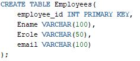

# Employee Management Database (Using Oracle as RDBMS)

This README provides an overview of the Employee Management Database, designed specifically for Oracle courses to manage and store information related to employees and organizational structure. It includes tables for Countries, Departments, Roles, Managers, Employees, Allowance, and Attendance records.

## Table Structures

### Employees Table

```sql
CREATE TABLE Employees(
    employee_id INT PRIMARY KEY,
    Ename VARCHAR(100),
    Erole VARCHAR(50),
    email VARCHAR(100)
);
```


